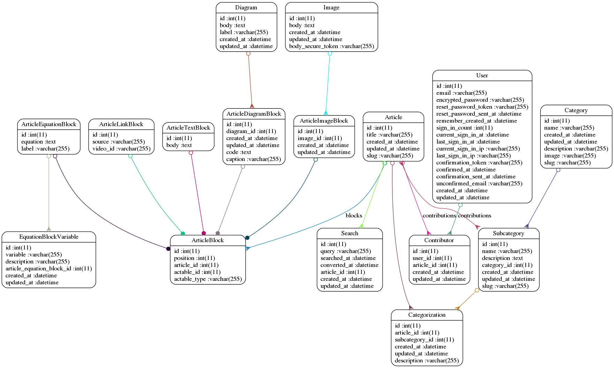

== README

This README would normally document whatever steps are necessary to get the
application up and running.

Things you may want to cover:

* Ruby version

* System dependencies
  -Default Vagrant package Michael has provided does not have ImageMagick installed. To install: sudo apt-get install imagemagick

* Configuration

* Database creation

* Database initialization

* How to run the test suite

* Services (job queues, cache servers, search engines, etc.)

* Deployment instructions

* ...

Please feel free to use a different markup language if you do not plan to run
<tt>rake doc:app</tt>.
